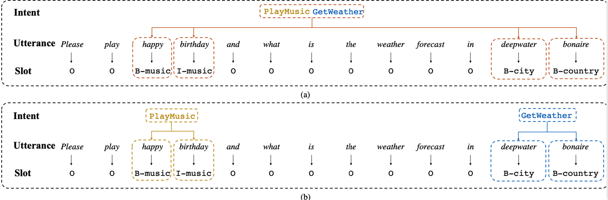
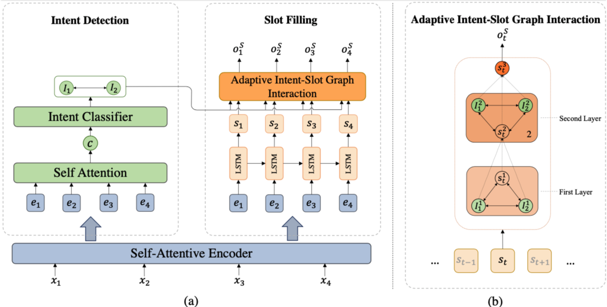
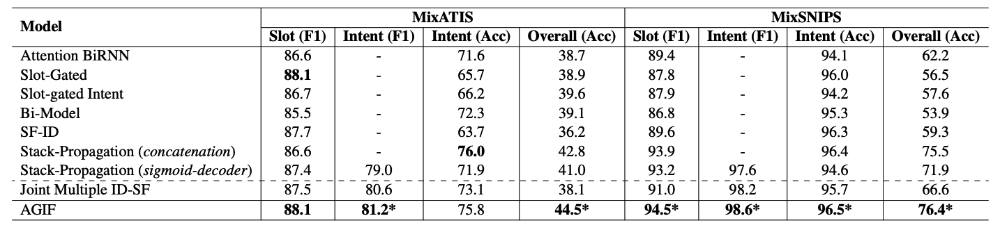
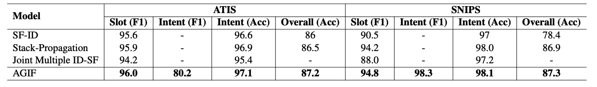
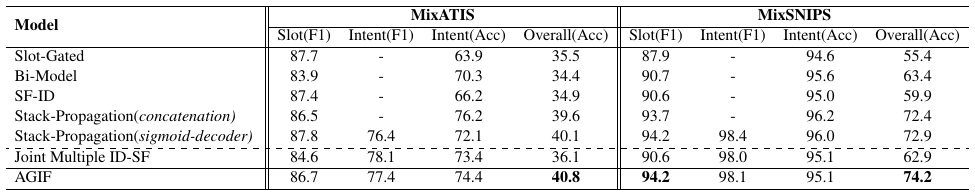

# AGIF: An Adaptive Graph-Interactive Framework for Joint Multiple Intent Detection and Slot Filling

This repository contains the official `PyTorch` implementation of the paper: 

**AGIF: An Adaptive Graph-Interactive Framework for Joint Multiple Intent Detection and Slot Filling**. [Libo Qin](http://ir.hit.edu.cn/~lbqin/), [Xiao Xu](http://ir.hit.edu.cn/~xxu/), [Wanxiang Che](http://ir.hit.edu.cn/~car/), [Ting Liu](http://ir.hit.edu.cn/~liuting/). ***EMNLP 2020 Accept-Findings***. [[Paper(Arxiv)]](https://arxiv.org/pdf/2004.10087.pdf) [[Paper]](https://www.aclweb.org/anthology/2020.findings-emnlp.163/)

If you use any source codes or the datasets included in this toolkit in your work, please cite the following paper. The bibtex are listed below:

<pre>
@inproceedings{qin-etal-2020-agif,
    title = "{AGIF}: An Adaptive Graph-Interactive Framework for Joint Multiple Intent Detection and Slot Filling",
    author = "Qin, Libo  and
      Xu, Xiao  and
      Che, Wanxiang  and
      Liu, Ting",
    booktitle = "Findings of the Association for Computational Linguistics: EMNLP 2020",
    month = nov,
    year = "2020",
    address = "Online",
    publisher = "Association for Computational Linguistics",
    url = "https://www.aclweb.org/anthology/2020.findings-emnlp.163",
    pages = "1807--1816",
    abstract = "In real-world scenarios, users usually have multiple intents in the same utterance. Unfortunately, most spoken language understanding (SLU) models either mainly focused on the single intent scenario, or simply incorporated an overall intent context vector for all tokens, ignoring the fine-grained multiple intents information integration for token-level slot prediction. In this paper, we propose an Adaptive Graph-Interactive Framework (AGIF) for joint multiple intent detection and slot filling, where we introduce an intent-slot graph interaction layer to model the strong correlation between the slot and intents. Such an interaction layer is applied to each token adaptively, which has the advantage to automatically extract the relevant intents information, making a fine-grained intent information integration for the token-level slot prediction. Experimental results on three multi-intent datasets show that our framework obtains substantial improvement and achieves the state-of-the-art performance. In addition, our framework achieves new state-of-the-art performance on two single-intent datasets.",
}
</pre>


In the following, we will guide you how to use this repository step by step.

## Architecture


## Results




> Tips: We find some repeated sentences in the `MixATIS` and `MixSNIPS` datasets so that we clean these two datasets and name them `MixATIS_clean` and `MixSNIPS_clean`. 
>
> There are `[13162, 759, 828]` utterances for training, validation and testing in the `MixATIS_clean` and `[39776, 2198, 2199]` in the `MixSNIPS_clean`.
>
**We recommend using the cleaned version datasets.** We rerun all the experiments and the results are as follows:



## Preparation

Our code is based on PyTorch 1.2 Required python packages:

-   numpy==1.18.1
-   tqdm==4.32.1
-   pytorch==1.2.0
-   python==3.7.3
-   cudatoolkit==9.2

We highly suggest you using [Anaconda](https://www.anaconda.com/) to manage your python environment.

## How to Run it

The script **train.py** acts as a main function to the project, you can run the experiments by the following commands.

```Shell
# MixATIS dataset
python train.py -g -bs=16 -ne=100 -dd=./data/MixATIS -lod=./log/MixATIS -sd=./save/MixATIS -nh=4 -wed=32 -sed=128 -ied=64 -sdhd=64 -dghd=64 -ln=MixATIS.txt

# MixSNIPS dataset
python train.py -g -bs=64 -ne=50 -dd=./data/MixSNIPS -lod=./log/MixSNIPS -sd=./save/MixSNIPS -nh=8 -wed=32 -ied=64 -sdhd=64 -ln=MixSNIPS.txt

# ATIS dataset
python train.py -g -bs=16 -ne=300 -dd=./data/ATIS -lod=./log/ATIS -sd=./save/ATIS -nh=4 -wed=64 -ied=128 -sdhd=128 -ln=ATIS.txt

# SNIPS dataset
python train.py -g -bs=16 -ne=200 -dd=./data/SNIPS -lod=./log/SNIPS -sd=./save/SNIPS -nh=8 -wed=64 -ied=64 -sdhd=64 -ln=SNIPS.txt 
```

We also provide our reported model parameters in the `save/best` directory, you can run the following command to evaluate them and so on.

```SHELL
# MixATIS dataset
python train.py -g -bs=16 -ne=0 -dd=./data/MixATIS -lod=./log/MixATIS -sd=./save/best/MixATIS -ld=./save/best/MixATIS -nh=4 -wed=32 -sed=128 -ied=64 -sdhd=64 -dghd=64 -ln=MixATIS.txt

# MixSNIPS dataset
python train.py -g -bs=64 -ne=0 -dd=./data/MixSNIPS -lod=./log/MixSNIPS -sd=./save/best/MixSNIPS -ld=./save/best/MixSNIPS -nh=8 -wed=32 -ied=64 -sdhd=64 -ln=MixSNIPS.txt

# ATIS dataset
python train.py -g -bs=16 -ne=0 -dd=./data/ATIS -lod=./log/ATIS -sd=./save/best/ATIS -ld=./save/best/ATIS -nh=4 -wed=64 -ied=128 -sdhd=128 -ln=ATIS.txt

# SNIPS dataset
python train.py -g -bs=16 -ne=0 -dd=./data/SNIPS -lod=./log/SNIPS -sd=./save/best/SNIPS -ld=./save/best/SNIPS -nh=8 -wed=64 -ied=64 -sdhd=64 -ln=SNIPS.txt 
```

Due to some stochastic factors(*e.g*., GPU and environment), it maybe need to slightly tune the hyper-parameters using grid search to reproduce the results reported in our paper. All the hyper-parameters are in the `utils/config.py` and here are the suggested hyper-parameter settings:

-   Number of attention heads [4, 8]
-   Intent Embedding Dim [64, 128]
-   Word Embedding Dim [32, 64]
-   Slot Embedding Dim [32, 64, 128]
-   Decoder Gat Hidden Dim [16, 32, 64]
-   Batch size [16, 32, 64]
-   `Intent Embedding Dim` must equal to `Slot Decoder Hidden Dim`

> P.S. We just slightly tune the hyper-parameters.


If you have any question, please issue the project or email [me](mailto:xxu@ir.hit.edu.cn) or [lbqin](mailto:lbqin@ir.hit.edu.cn) and we will reply you soon.

## Acknowledgement

A Stack-Propagation Framework with Token-Level Intent Detection for Spoken Language Understanding. Libo Qin, Wanxiang Che, Yangming Li, Haoyang Wen and Ting Liu. *(EMNLP 2019)*. Long paper. [[pdf]](https://www.aclweb.org/anthology/D19-1214/) [[code]](https://github.com/LeePleased/StackPropagation-SLU)

>   We are highly grateful for the public code of Stack-Propagation!